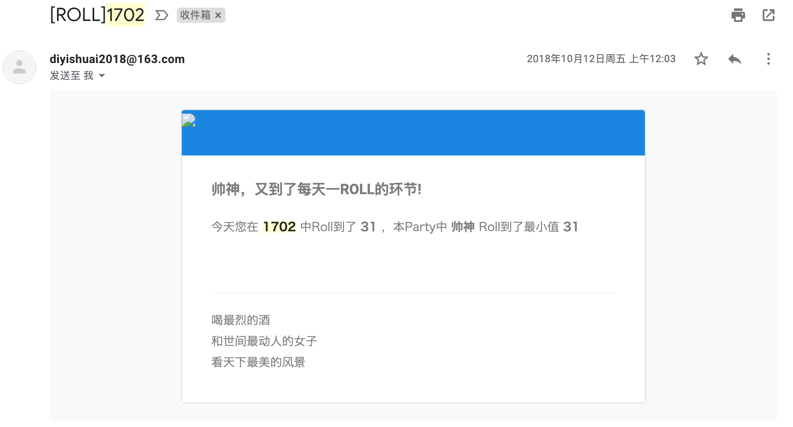
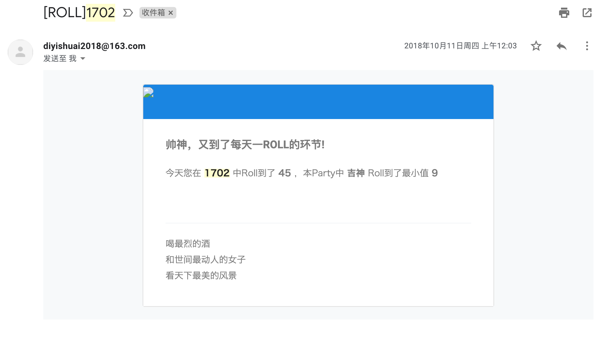

# 1702
和北京的两个小伙伴一起租了个三居室，门牌号码1702,常规的轮询式值日不刺激也不紧张，那么就用`Roll`点的方式来决定谁值日！

## 时间
每天`00:01`进行roll点，每天`00:03`发送邮件

## 效果
Roll到我：

Roll到他人

## 数据初始化

运行[1702-domain/src/test/java/com/diyishuai/hi1702/test/DBManage.java](https://github.com/di1shuai/1702/blob/master/1702-domain/src/test/java/com/diyishuai/hi1702/test/DBManage.java)中的`init`方法即可进行数据初始化